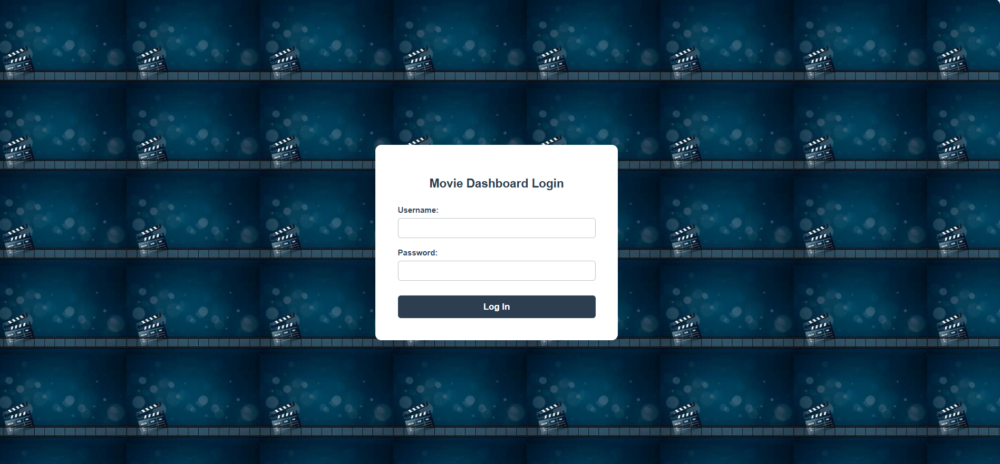
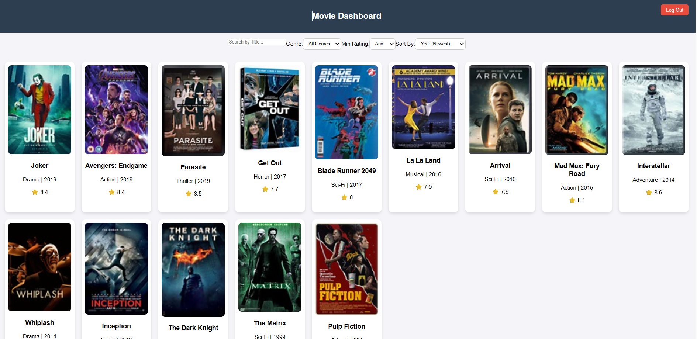
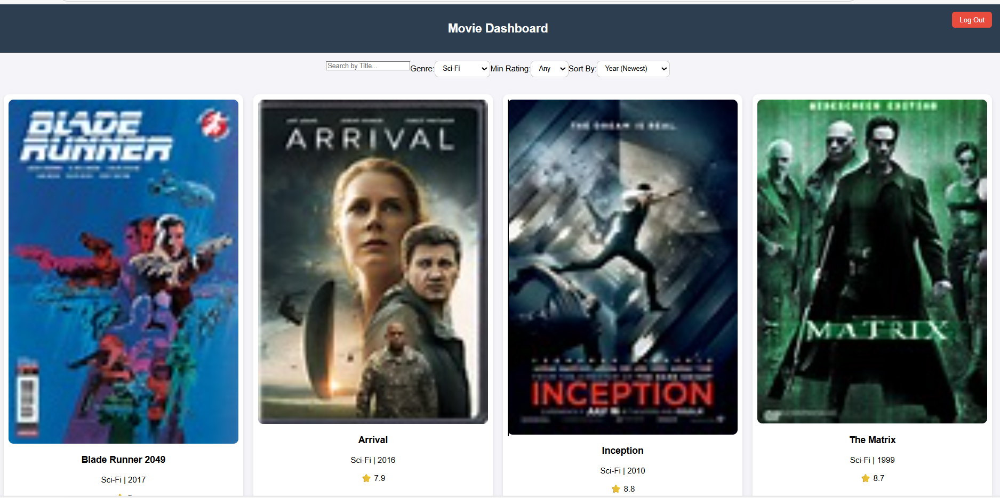

# Movie Dashboard

## Project Overview

The Movie Dashboard is a modern, responsive Single-Page Application (SPA) built with **React.js**. It is designed to showcase proficiency in state management, data filtering, and modular component architecture.

The application allows users to browse a catalog of films efficiently using a powerful filtering system, demonstrating best practices for managing and displaying large datasets.


## Key Features

The application includes the following core, professional functionalities:

* **Advanced Filtering Controls:** Allows users to filter and refine the movie catalog using multiple criteria simultaneously.
    * **Genre Buttons:** Filter results instantly by selecting a genre button, providing a great user experience.
    * **Minimum Rating:** Filter movies that meet or exceed a specific rating (e.g., 8.0+).
    * **Sort By:** Sort the results by **Year** (Newest first) or **Rating** (Highest first).
    * **Search Functionality:** Instant filtering of movies by typing a specific title.
* **Modular Architecture:** Components (`Navbar`, `FilterBar`, `MovieCard`) are separated into their own files, demonstrating a clean, scalable, and maintainable project structure.
* **External Data Source:** Movie data is sourced from an external JSON file (`./data/movies.json`), showcasing a professional practice of decoupling data from the main application logic.
* **Responsive UI:** The movie card grid adapts gracefully to ensure usability across different screen sizes.

---


##  Tech Stack

| Category | Technologies |
|-----------|---------------|
| **Frontend** | React.js, HTML5, CSS3, JavaScript |
| **Styling** | Tailwind CSS / Custom CSS |
| **Data Handling** | Local JSON (movies.json) |
| **Build Tool** | Vite |
| **Version Control** | Git & GitHub |

---


## Screenshots

### Home Page


### Filter & Search


### Pages
.
## Installation and Setup

Follow these steps to get the project running locally.

### Prerequisites

* Node.js (LTS version recommended)
* npm or yarn

### Steps

1.  **Clone the repository or download the files.**
2.  **Navigate to the project directory:**
    ```bash
    cd movie-dashboard
    ```
3.  **Install dependencies:**
    ```bash
    npm install
    # or
    yarn install
    ```
4.  **Run the application:**
    ```bash
    npm start
    # or
    yarn start
    ```
    The application should open automatically in your browser at `http://localhost:3000`.

---


